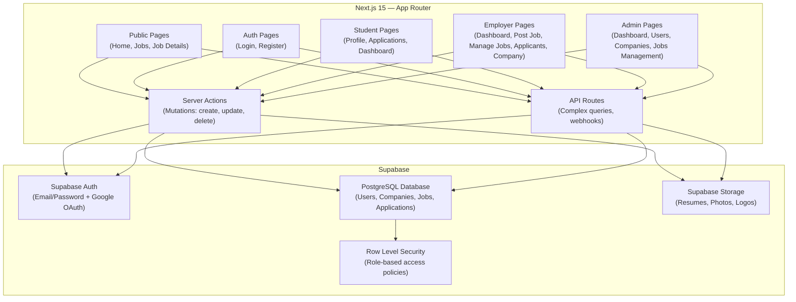
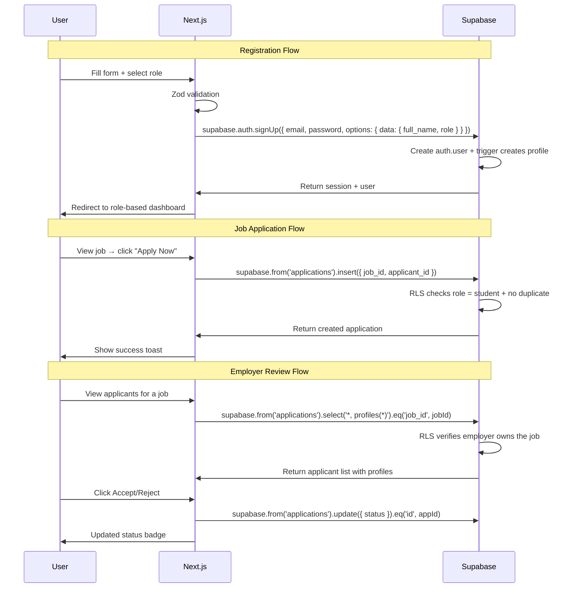

# 🚀 Job Portal Platform — Full Implementation Plan

> Aligned with [Job_Portal_Implementation_Guide.pdf](file:///h:/Job portel/Job_Portal_Implementation_Guide.pdf)
> Stack: **Next.js 15 + Supabase**

A comprehensive Job Portal connecting **Job Seekers (Students)**, **Employers**, and **Administrators** — built on **Next.js** with **Supabase** handling auth, database, and file storage.

---

## Tech Stack

| Layer | Technology | Purpose |
|-------|-----------|---------|
| **Framework** | Next.js 15 (App Router) | SSR, API routes, file-based routing |
| **Database** | Supabase (PostgreSQL) | Relational database with Row Level Security |
| **Auth** | Supabase Auth | Email/password + Google OAuth, session management |
| **Storage** | Supabase Storage | Resumes, profile photos, company logos |
| **State** | React Context + SWR | Client-side state & data fetching |
| **Styling** | Vanilla CSS (Custom Design System) | Bold & Corporate aesthetic |
| **Animations** | Framer Motion | Page transitions & micro-interactions |
| **Icons** | Lucide React | Lightweight icon library |
| **Forms** | React Hook Form + Zod | Form handling & validation |

> [!NOTE]
> **Why Supabase replaces the entire Express backend:**
> - **Supabase Auth** → replaces JWT + bcrypt + auth middleware
> - **Supabase PostgreSQL** → replaces MongoDB + Mongoose models
> - **Supabase Storage** → replaces Multer + local uploads folder
> - **Row Level Security (RLS)** → replaces role middleware
> - **Next.js API Routes / Server Actions** → replaces Express controllers
>
> This means **no separate backend project** is needed. Everything runs in one Next.js app.

---

## Accenture-Inspired Design Features

Inspired by [accenture.com/in-en](https://www.accenture.com/in-en), we adopt these 3 premium design patterns:

### 1. 🎬 Bold Split-Text Hero with Animated Gradient Background
- **Full-viewport hero section** with a moving gradient animation (deep navy → electric blue → purple → navy loop)
- **Large, asymmetric split typography**: "Find Your" on line 1 (regular weight), "Dream Job" on line 2 (extra bold, accented)
- **Frosted glass search bar** overlaid on the hero — keyword + location + search button
- **Animated statistics counters** below the search: "10,000+ Jobs" • "500+ Companies" • "50,000+ Applications"
- **Subtle particle or floating shape animation** in the background for depth
- Reference: Accenture's "Together We / Reinvented" hero with video background — we use animated CSS gradients instead (lighter, faster)

### 2. 🌗 Dark / Light Section Alternation
- **Every other section alternates** between dark (Deep Navy `#0A1628`) and light (Off-White `#F8FAFC`) backgrounds
- Creates **visual rhythm and premium depth** throughout the page
- Dark sections use light text (`#F1F5F9`) with Electric Blue accents
- Light sections use dark text (`#0F172A`) with Navy accents
- **Smooth gradient transitions** between sections (no hard edges)
- Section layout pattern for Home page:
  ```
  [DARK]  Hero — Animated gradient + search bar
  [LIGHT] Featured Jobs — 3-column card grid
  [DARK]  Job Categories — Icon grid with glow effects
  [LIGHT] How It Works — 3-step process
  [DARK]  Company Spotlights Carousel — Storytelling carousel
  [LIGHT] Success Stories Carousel — Testimonials
  [DARK]  Statistics + CTA — Counters + "Get Started" button
  [DARK]  Footer
  ```

### 3. 📖 Storytelling Carousels (Accenture-Style)
Two auto-play carousels with pause/play controls, inspired by Accenture's image-text carousel pattern:

#### Company Spotlights Carousel
- **Layout**: Image on left (60%), text content on right (40%)
- **Content**: Featured employer stories — company logo, description, number of open positions, "View Jobs →" CTA
- **Controls**: Previous / Counter ("1/5") / Next + Auto-play with Pause button
- **Animation**: Smooth slide transition with Framer Motion
- **Background**: Dark section with subtle gradient

#### Success Stories Carousel  
- **Layout**: Large quote with applicant photo, name, role, and company
- **Content**: Job seeker testimonials — "How I landed my dream job at [Company]..."
- **Design**: Large quotation marks, profile photo circle, company logo
- **Controls**: Dot indicators + swipe on mobile
- **Animation**: Fade transition between stories

---

## Indeed-Inspired UX Features

Inspired by [in.indeed.com](https://in.indeed.com/), we adopt these 10 high-impact UX patterns:

### 1. ⭐ Split-Pane Job Results (Indeed's #1 UX Pattern)
- **Two-column layout** on the Jobs page: scrollable job card list on the LEFT (40%), full job detail preview panel on the RIGHT (60%)
- **Click a job card** → instantly loads full details in the right pane **without page navigation**
- **Both panels scroll independently** for seamless browsing
- **Active card highlight**: selected job card gets an Electric Blue left border + subtle background tint
- **Mobile fallback**: on mobile, tapping a card navigates to the full detail page (single-column)
- **No footer on results**: maximize screen real estate for job browsing

### 2. Horizontal Filter Chips Toolbar
- **Pill-shaped filter buttons** above the results: `Pay` · `Remote` · `Job Type` · `Experience` · `Date Posted`
- Each pill opens a **dropdown with checkboxes** for multi-select filtering
- **Active filter indicator**: filled pill with count badge (e.g., "Job Type (2)")
- **Clear all filters** button when any filters are active
- Sticky below the search bar while scrolling

### 3. 3-Field Search Bar (What + Where + Experience)
- **"What"** field: job title, keywords, or company name
- **"Where"** field: city, state, or "Remote"
- **"Experience"** dropdown: Fresher · 1-2 yrs · 3-5 yrs · 5-10 yrs · 10+ yrs *(TimesJobs-inspired)*
- **Search button** with icon
- Used on both the **Home hero** and the **Jobs page** (sticky top)
- Consistent search experience across the entire portal

### 4. Benefit Tags on Job Cards
- Quick visual **pill tags** showing job perks: `Remote` · `Flexible Schedule` · `Health Insurance` · `Paid Time Off` · `Provident Fund`
- Stored as `benefits TEXT[]` array in the jobs table
- Color-coded: green for benefits, blue for job type, gray for experience

### 5. Save / Bookmark Jobs
- **Bookmark icon** (heart or ribbon) on every job card's top-right corner
- Toggle on/off with animation (filled vs. outline)
- Saved jobs appear in **Dashboard → Saved Jobs** section
- Requires authentication — prompts login if not signed in
- New `saved_jobs` table in Supabase to track user bookmarks

### 6. Sort by Relevance / Date Toggle
- **Sort dropdown** on results page: `Relevance` (default) · `Newest First` · `Salary: High to Low` · `Salary: Low to High`
- Updates results immediately without page reload
- Subtle sort indicator icon

### 7. "Quick Apply" Badge
- Green badge on job cards where users can **apply directly through the portal** (vs. redirecting to company site)
- Signals one-click application with saved profile data
- Visual: small green pill with checkmark icon

### 8. Search Autocomplete
- **Dropdown suggestions** appear as the user types in the "What" field
- Sources: popular job titles, company names, skills from the database
- **Debounced API call** (300ms) for real-time suggestions
- Keyboard navigation (arrow keys + Enter to select)
- Highlights matching characters in bold

### 9. Keyword Highlighting in Results
- **Search terms are bolded** in job card titles and description snippets
- Uses a highlight wrapper component that wraps matching text in `<mark>` tags
- Helps users instantly spot relevant matches

### 10. Share Job
- **Share button** on the job detail panel (both split-pane and full page)
- Options: **Copy Link** · **WhatsApp** · **LinkedIn** · **Twitter/X** · **Email**
- Uses Web Share API on mobile for native share sheet
- Generates a shareable URL: `/jobs/[id]?ref=share`

---

## TimesJobs-Inspired Features

Inspired by [timesjobs.com](https://www.timesjobs.com/), we adopt these 4 practical enhancements:

### 1. Experience Dropdown on Search Bar (3rd Field)
- **Upgrades the 2-field search to 3 fields**: "What" + "Where" + "Experience Level"
- **Experience dropdown options**: Fresher · 1-2 yrs · 3-5 yrs · 5-10 yrs · 10+ yrs
- Appears on both the **Home hero** and **Jobs page** search bar
- Helps users narrow results instantly without needing to apply filters afterward

### 2. Posted Date on Job Cards
- **Relative time display**: "Posted 2 days ago", "Posted 1 week ago", "Posted today"
- Shown on every job card below the company name
- Helps users identify **fresh listings** at a glance
- Uses `created_at` timestamp from the jobs table, formatted with a relative-time utility

### 3. Skills Tags on Job Cards
- **Required skills shown as chips** directly on job cards (alongside benefit tags)
- Color-coded: **blue chips** for skills (React, Node.js, Python), **green chips** for benefits
- Max 4-5 skills shown on card, with "+3 more" overflow indicator
- Helps users instantly see if their skills match before clicking

### 4. Required vs. Preferred Skills on Job Detail
- Job detail page separates skills into two structured sections:
  - **"Required Skills"** (Must Have) — skills the candidate needs
  - **"Preferred Skills"** (Nice-to-Have) — bonus skills that strengthen the application
- Stored as separate arrays in the database: `required_skills TEXT[]` and `preferred_skills TEXT[]`
- Visual distinction: required skills have solid chips, preferred skills have outline chips
- Employers fill both sections when posting a job

---

## Wellfound-Inspired Features

Inspired by [wellfound.com](https://wellfound.com/), we adopt these 5 startup-oriented UX patterns:

### 2. Interactive Hero Tag Cloud
- Centered **tag cloud** below the main homepage search bar containing popular searches:
  - *Job Roles*: `Full Stack` · `Frontend` · `React Developer` · `Node.js`
  - *Locations / Settings*: `Remote` · `Hybrid` · `Internship`
- Clicking any tag automatically populates the search bar and runs the query immediately

### 3. Structured Company Metadata Panel
- Job details pane displays structured company information:
  - **Metrics**: Founding Year, Company Size (e.g., 10-50, 100-500), Industry/Niche
  - **Tech Stack**: Icon row of the company's tech stack (e.g., Next.js, Postgres, Tailwind)
- Stored on the `companies` table

### 4. Direct Recruiter Info Card
- Displays the person who created the listing to humanize the application
- Visual element: recruiter avatar, name, and role (e.g., "Posted by Pranav, Co-founder & CEO")
- Extracted via join on `jobs.created_by` to the `profiles` table

### 5. Profile-as-Resume Quick Apply
- Candidates can apply instantly with one click using their pre-built online profile (no file upload or cover letter required)
- Signals one-click submission; fetches student skills, experience, and profile details to send to the employer

### 6. Curated Collections Grid
- Home page feature sections showing curated groupings:
  - "Hot Startups Hiring Now" · "High-Paying Remote Roles" · "No-Experience Needed Internships"
- Powered by specific query combinations on search endpoints

---

## Hirist-Inspired Features

Inspired by [hirist.tech](https://www.hirist.tech/), we adopt these 5 tech-focused enhancements:

### 1. ⭐ Multi-Apply Checkbox
- **Checkboxes on every job card** in the left-pane job list
- Users can **select multiple jobs** and click a **bulk "Apply to Selected" button** at the top
- All selected jobs receive a one-click profile-based application
- **Select All / Deselect All** toggle at the top of the list
- Floating action bar appears when ≥1 job is selected: "3 jobs selected — [Apply to All]"
- Massive time saver for active job seekers

### 2. ⭐ Recruiter Activity Tracker
- **Transparency panel** on the job detail page showing:
  - 👁️ **Views**: how many people viewed this job (e.g., "354")
  - 📩 **Applications**: how many applied (e.g., "191")
  - ✅ **Recruiter Actions**: how many the recruiter acted on (e.g., "45 shortlisted")
  - 🟢 **Last Active**: when the recruiter was last active (e.g., "2 hours ago")
- Gives candidates confidence that the recruiter is actively reviewing applications
- `view_count` tracked via Supabase function incrementing on each view

### 3. Persistent Category Tabs on Search Results
- **Horizontal sticky tabs** at the top of the Jobs search page:
  - `All` · `AI/ML` · `Frontend` · `Backend` · `Full Stack` · `Mobile` · `DevOps` · `Data` · `Design`
- Click a tab → results filter instantly to that category
- Active tab has an accent-colored underline indicator
- Sits between the search bar and the filter chips

### 4. View/Application Counters on Job Cards
- Small counter text on each job card: "354 views · 191 applied"
- Creates **urgency** ("lots of people are applying!") and **social proof**
- Subtle gray text below the posted date

### 5. Nested Sub-Categories
- Categories have a **second level** for deeper organization:
  - Software Dev → Frontend, Backend, Full Stack, Mobile, DevOps
  - Data → Data Science, Data Engineering, Analytics
  - Design → UI/UX, Product Design, Graphic Design
- Stored as `category` and `sub_category` on the `jobs` table
- Categories grid on homepage shows top-level, clicking reveals sub-categories

---

## Unstop-Inspired Features

Inspired by [unstop.com](https://unstop.com/), we adopt these 4 student-engagement and assessment features:

### 1. ⌛ Deadline Countdown Timers
- **Closes-soon alert pills** displayed on job cards (e.g. "Closes in 3 days", "Closes today")
- Stored as `application_deadline TIMESTAMPTZ` on the `jobs` table
- Automatically badges items under 3 days with highlight styles (orange/red gradients) to drive applications

### 2. 📅 Recruitment Rounds Timeline
- Visual vertical progress tracker on the job detail page detailing recruitment stages:
  - e.g., `Step 1: Resume Screening` ➜ `Step 2: Technical Assessment` ➜ `Step 3: Partner/HR Interview`
- Stored as an ordered text array `rounds_timeline TEXT[]` on the `jobs` table
- Keeps application expectations completely transparent for applicants

### 3. 🎯 MCQ Screening Quiz Builder
- Employers can attach a **3-5 question screening quiz** when posting a job
- Quiz format: Multiple Choice Questions (MCQ) with 4 options
- **Inline quiz flow**: When candidates click "Apply", if a quiz is configured, they must answer the MCQs before their application is submitted
- Candidate choices stored in database for recruiters to filter out unqualified submissions instantly

### 4. 🎓 1-on-1 Mentorship Booking
- Dedicated mentorship section (`/mentorship`) where students can book short mock-interview or resume-review sessions with mentors (alumni, recruiters, or senior developers)
- Mentors host calendars with available time slots
- Student books a slot ➜ generates a meeting link and puts it on both dashboards

---

## Naukri-Inspired Features

Inspired by [naukri.com](https://www.naukri.com/), we adopt these 3 candidate dashboard and review features:

### 1. 📈 Profile Strength Meter & Checklist
- **Radial circular progress indicator** displayed on the Student Dashboard showing profile completion percentage (e.g., "75% Strength")
- **Dynamic checklist** lists missing details to encourage completion:
  - `[ ] Add Resume (+15%)` · `[ ] Add 3 Skills (+10%)` · `[ ] Write Bio (+10%)`
- Motivates students to submit high-quality profiles to employers

### 2. 🔔 Saved Search Job Alerts
- Candidates can save their search filters (What + Where + Experience) as custom "Job Alerts"
- Alerts manager dashboard page lets users toggle email alerts on/off
- Automatically alerts users when new jobs matching their saved criteria are posted

### 3. ⭐ Company Rating & Review Badge
- Displays rating stars next to company names on job cards and listings (e.g. `4.2 ★ (120 reviews)`)
- Stored as `rating` and `review_count` fields on the `companies` table
- Adds instant brand trust and social proof to corporate job postings

---

## Indeed Company Hub Features

Inspired by [in.indeed.com/companies](https://in.indeed.com/companies), we adopt these 3 employer branding and comparison features:

### 1. 📊 5-Category Review Breakdown
- Shows employee reviews split into five key domains displayed as neat progress bars on company profile:
  - **Work-Life Balance** (`rating_balance`)
  - **Compensation & Benefits** (`rating_pay`)
  - **Job Security & Advancement** (`rating_growth`)
  - **Management** (`rating_mgmt`)
  - **Culture** (`rating_culture`)
- Gives candidates rich insights into specific qualities of target employers

### 2. ⚔️ Side-by-Side Company Compare
- Comparison page (`/companies/compare`) allowing candidate searches of two companies
- Renders metrics side-by-side: sub-ratings comparisons, employee approval levels, and total active listings count

### 3. 🎨 "Why Join Us" Showcase
- Rich-text editor field (`why_join_us TEXT` in DB) where employers publish custom testimonials, image layouts, videos, or benefits pitches on their profile snapshot page

---

## Apna-Inspired Features

Inspired by [apna.co](https://apna.co/), we adopt these 2 candidate-recruiter connectivity features:

### 1. 📞 Direct Recruiter Contact (Call / WhatsApp HR)
- Displays call and chat action buttons on the job detail page for verified jobs:
  - **Call HR**: triggers `tel:hr_phone` directly on mobile devices
  - **WhatsApp HR**: triggers `https://wa.me/hr_whatsapp?text=...` with a pre-filled matching job message
- Bypasses slow corporate feedback loops and helps fast-track applications

### 2. 🏷️ Work Timing & English Level Tags
- Shows operational timing constraints and language requirements on job cards:
  - **Work Timing** (e.g. `9 AM - 6 PM | 5 Days`)
  - **English Level** (e.g. `Conversational English` or `Basic English`)
- Helps candidates immediately filter out positions that don't fit their schedule or language qualifications

---

## User Review Required

> [!IMPORTANT]
> **Supabase Project**: You'll need to create a free Supabase project at [supabase.com](https://supabase.com). I'll need the **Project URL** and **Anon Key** to configure the connection. Do you already have a Supabase account?

> [!IMPORTANT]
> **Design Palette — Bold & Corporate**:
> - Primary: Deep Navy `#0A1628`
> - Accent: Electric Blue `#2563EB`
> - Secondary: Warm Gold `#F59E0B`
> - Surfaces: Slate grays
> - Typography: **Inter** (body) + **Outfit** (headings)

> [!WARNING]
> **Google OAuth**: If you want Google login, you'll need to set up Google OAuth credentials in the Supabase dashboard. I can guide you through this during Phase 4.

---

## Open Questions

1. **Brand Name**: Keep **"HIRRD"** or a different name?
2. **Blog Feature**: The PDF doesn't include a blog. Should I still add it (from your earlier selection)?
3. **Email Notifications**: Should Supabase send confirmation emails on signup and application status changes?
4. **Deployment**: Deploy to **Vercel** (recommended for Next.js)?

---

## Architecture Overview



---

## Project Structure

```
h:\Job portel\
├── app/
│   ├── layout.js                    # Root layout (Navbar + Footer)
│   ├── page.js                      # Home page
│   ├── globals.css                  # Global design system + tokens
│   │
│   ├── (auth)/                      # Auth group (no layout nesting)
│   │   ├── login/page.js
│   │   └── register/page.js
│   │
│   ├── jobs/
│   │   ├── page.js                  # Job listings + search/filters
│   │   └── [id]/page.js             # Job detail page
│   │
│   ├── companies/
│   │   ├── page.js                  # Company directory
│   │   └── [id]/page.js             # Company profile
│   │
│   ├── dashboard/
│   │   ├── layout.js                # Dashboard sidebar layout
│   │   ├── page.js                  # Redirect based on role
│   │   ├── student/
│   │   │   ├── page.js              # Student dashboard
│   │   │   ├── profile/page.js      # Edit profile
│   │   │   ├── applications/page.js # Applied jobs tracker
│   │   │   └── saved-jobs/page.js   # Bookmarked jobs list
│   │   ├── employer/
│   │   │   ├── page.js              # Employer dashboard
│   │   │   ├── company/page.js      # Create/edit company
│   │   │   ├── post-job/page.js     # Post new job
│   │   │   ├── manage-jobs/page.js  # Manage listings
│   │   │   └── applicants/[jobId]/page.js  # View applicants
│   │   └── admin/
│   │       ├── page.js              # Admin dashboard
│   │       ├── users/page.js        # User management
│   │       ├── companies/page.js    # Company management
│   │       └── jobs/page.js         # Job moderation
│   │
│   ├── about/page.js
│   ├── contact/page.js
│   │
│   └── api/                         # API route handlers (if needed)
│       └── webhooks/route.js
│
├── components/
│   ├── layout/
│   │   ├── Navbar/
│   │   │   └── Navbar.jsx
│   │   ├── Footer/
│   │   │   └── Footer.jsx
│   │   └── DashboardSidebar/
│   │       └── DashboardSidebar.jsx
│   ├── ui/
│   │   ├── Button/
│   │   │   └── Button.jsx
│   │   ├── Card/
│   │   │   └── Card.jsx
│   │   ├── Input/
│   │   │   └── Input.jsx
│   │   ├── Modal/
│   │   │   └── Modal.jsx
│   │   ├── Badge/
│   │   │   └── Badge.jsx
│   │   ├── Dropdown/
│   │   │   └── Dropdown.jsx
│   │   ├── Loader/
│   │   │   └── Loader.jsx
│   │   ├── Toast/
│   │   │   └── Toast.jsx
│   │   ├── DataTable/
│   │   │   └── DataTable.jsx
│   │   ├── Carousel/
│   │   │   └── Carousel.jsx
│   │   ├── AnimatedCounter/
│   │   │   └── AnimatedCounter.jsx
│   │   └── SectionDivider/
│   │       └── SectionDivider.jsx
│   ├── jobs/
│   │   ├── JobCard/
│   │   │   └── JobCard.jsx
│   │   ├── JobDetailPanel/
│   │   │   └── JobDetailPanel.jsx
│   │   ├── SplitPaneResults/
│   │   │   └── SplitPaneResults.jsx
│   │   ├── MultiApplyToolbar/
│   │   │   └── MultiApplyToolbar.jsx
│   │   ├── CategoryTabs/
│   │   │   └── CategoryTabs.jsx
│   │   ├── JobFilters/
│   │   │   └── JobFilters.jsx
│   │   ├── JobSearch/
│   │   │   └── JobSearch.jsx
│   │   ├── SearchAutocomplete/
│   │   │   └── SearchAutocomplete.jsx
│   │   ├── FilterChips/
│   │   │   └── FilterChips.jsx
│   │   ├── SortDropdown/
│   │   │   └── SortDropdown.jsx
│   │   ├── BenefitTags/
│   │   │   └── BenefitTags.jsx
│   │   ├── SkillsTags/
│   │   │   └── SkillsTags.jsx
│   │   ├── PostedDate/
│   │   │   └── PostedDate.jsx
│   │   ├── JobStatsCounter/
│   │   │   └── JobStatsCounter.jsx
│   │   ├── RecruiterActivity/
│   │   │   └── RecruiterActivity.jsx
│   │   ├── QuickApplyBadge/
│   │   │   └── QuickApplyBadge.jsx
│   │   ├── ShareJob/
│   │   │   └── ShareJob.jsx
│   │   ├── KeywordHighlight/
│   │   │   └── KeywordHighlight.jsx
│   │   ├── SaveJobButton/
│   │   │   └── SaveJobButton.jsx
│   │   ├── RecruiterCard/
│   │   │   └── RecruiterCard.jsx
│   │   ├── DeadlineTimer/
│   │   │   └── DeadlineTimer.jsx
│   │   ├── RecruitmentTimeline/
│   │   │   └── RecruitmentTimeline.jsx
│   │   ├── ScreeningQuiz/
│   │   │   └── ScreeningQuiz.jsx
│   │   ├── CompanyRating/
│   │   │   └── CompanyRating.jsx
│   │   ├── HRContactButtons/
│   │   │   └── HRContactButtons.jsx
│   │   └── SimilarJobs/
│   │       └── SimilarJobs.jsx
│   ├── companies/
│   │   ├── CompanyCard/
│   │   │   └── CompanyCard.jsx
│   │   ├── CompanyMetadata/
│   │   │   └── CompanyMetadata.jsx
│   │   ├── CategoryRatingsBar/
│   │   │   └── CategoryRatingsBar.jsx
│   │   ├── CompanyCompare/
│   │   │   └── CompanyCompare.jsx
│   │   └── WhyJoinUsShowcase/
│   │       └── WhyJoinUsShowcase.jsx
│   ├── mentorship/
│   │   ├── MentorCard/
│   │   │   └── MentorCard.jsx
│   │   ├── MentorList/
│   │   │   └── MentorList.jsx
│   │   └── MentorshipScheduler/
│   │       └── MentorshipScheduler.jsx
│   ├── dashboard/
│   │   ├── StatsCard/
│   │   │   └── StatsCard.jsx
│   │   ├── ApplicationsTable/
│   │   │   └── ApplicationsTable.jsx
│   │   ├── ActivityFeed/
│   │   │   └── ActivityFeed.jsx
│   │   ├── QuizBuilder/
│   │   │   └── QuizBuilder.jsx
│   │   ├── ProfileStrengthMeter/
│   │   │   └── ProfileStrengthMeter.jsx
│   │   ├── JobAlertsTable/
│   │   │   └── JobAlertsTable.jsx
│   │   └── Charts/
│   │       └── Charts.jsx
│   └── home/
│       ├── Hero/
│       │   └── Hero.jsx
│       ├── TagCloud/
│       │   └── TagCloud.jsx
│       ├── FeaturedJobs/
│       │   └── FeaturedJobs.jsx
│       ├── JobCollections/
│       │   └── JobCollections.jsx
│       ├── Categories/
│       │   └── Categories.jsx
│       ├── HowItWorks/
│       │   └── HowItWorks.jsx
│       ├── CompanySpotlights/
│       │   └── CompanySpotlights.jsx
│       ├── SuccessStories/
│       │   └── SuccessStories.jsx
│       ├── StatsAndCTA/
│       │   └── StatsAndCTA.jsx
│       └── SectionWrapper/
│           └── SectionWrapper.jsx
│
├── lib/
│   ├── supabase/
│   │   ├── client.js               # Browser Supabase client
│   │   ├── server.js               # Server-side Supabase client
│   │   └── middleware.js            # Auth middleware for Next.js
│   ├── actions/                     # Server Actions (mutations)
│   │   ├── auth.js                  # Register, login, logout
│   │   ├── jobs.js                  # Create, update, delete jobs
│   │   ├── companies.js             # Company CRUD
│   │   ├── applications.js          # Apply, update status
│   │   ├── users.js                 # Profile updates
│   │   └── upload.js                # File uploads
│   └── utils.js                     # Helpers, formatters, constants
│
├── hooks/
│   ├── useAuth.js                   # Auth state hook
│   ├── useJobs.js                   # Jobs data fetching
│   └── useApplications.js           # Applications data fetching
│
├── context/
│   └── AuthContext.js               # Auth provider with Supabase session
│
├── public/
│   └── images/
│
├── middleware.js                     # Next.js middleware (route protection)
├── next.config.js
├── .env.local                       # Supabase keys
└── package.json
```

---

## Supabase Database Schema (PostgreSQL)

### Tables

#### `profiles` (extends Supabase auth.users)
```sql
CREATE TABLE profiles (
  id UUID REFERENCES auth.users(id) ON DELETE CASCADE PRIMARY KEY,
  full_name TEXT NOT NULL,
  email TEXT NOT NULL UNIQUE,
  role TEXT NOT NULL DEFAULT 'student' CHECK (role IN ('student', 'employer', 'admin')),
  profile_photo TEXT,           -- Supabase Storage URL
  resume TEXT,                  -- Supabase Storage URL
  skills TEXT[],                -- Array of skill tags
  bio TEXT,
  phone TEXT,
  location TEXT,
  created_at TIMESTAMPTZ DEFAULT NOW(),
  updated_at TIMESTAMPTZ DEFAULT NOW()
);
```

#### `companies`
```sql
CREATE TABLE companies (
  id UUID DEFAULT gen_random_uuid() PRIMARY KEY,
  name TEXT NOT NULL,
  description TEXT NOT NULL,
  website TEXT,
  logo TEXT,                    -- Supabase Storage URL
  location TEXT NOT NULL,
  industry TEXT,
  size TEXT,                    -- e.g., '1-50', '51-200', '201-500'
  tech_stack TEXT[],            -- Wellfound-inspired: company tech stack icons
  founded_year INTEGER,         -- Wellfound-inspired: year founded
  rating NUMERIC DEFAULT 0.0 CHECK (rating >= 0 AND rating <= 5), -- Naukri-inspired: company star rating
  review_count INTEGER DEFAULT 0, -- Naukri-inspired: company review count
  rating_balance NUMERIC DEFAULT 0.0 CHECK (rating_balance >= 0 AND rating_balance <= 5), -- Indeed-inspired
  rating_pay NUMERIC DEFAULT 0.0 CHECK (rating_pay >= 0 AND rating_pay <= 5),             -- Indeed-inspired
  rating_growth NUMERIC DEFAULT 0.0 CHECK (rating_growth >= 0 AND rating_growth <= 5),       -- Indeed-inspired
  rating_mgmt NUMERIC DEFAULT 0.0 CHECK (rating_mgmt >= 0 AND rating_mgmt <= 5),             -- Indeed-inspired
  rating_culture NUMERIC DEFAULT 0.0 CHECK (rating_culture >= 0 AND rating_culture <= 5),       -- Indeed-inspired
  why_join_us TEXT,             -- Indeed-inspired: Rich content visual HTML showcase
  is_verified BOOLEAN DEFAULT FALSE,
  created_by UUID REFERENCES profiles(id) ON DELETE CASCADE NOT NULL,
  created_at TIMESTAMPTZ DEFAULT NOW(),
  updated_at TIMESTAMPTZ DEFAULT NOW()
);
```

#### `jobs`
```sql
CREATE TABLE jobs (
  id UUID DEFAULT gen_random_uuid() PRIMARY KEY,
  title TEXT NOT NULL,
  description TEXT NOT NULL,
  location TEXT NOT NULL,
  salary NUMERIC NOT NULL,
  experience INTEGER NOT NULL DEFAULT 0,
  positions INTEGER NOT NULL DEFAULT 1,
  job_type TEXT DEFAULT 'full-time' CHECK (job_type IN ('full-time', 'part-time', 'contract', 'remote', 'internship')),
  required_skills TEXT[],              -- TimesJobs-inspired: Must-have skills
  preferred_skills TEXT[],             -- TimesJobs-inspired: Nice-to-have skills
  status TEXT DEFAULT 'active' CHECK (status IN ('active', 'closed', 'draft')),
  is_featured BOOLEAN DEFAULT FALSE,
  is_quick_apply BOOLEAN DEFAULT TRUE, -- Indeed-inspired: can apply directly on portal
  benefits TEXT[],                     -- Indeed-inspired: 'Remote', 'Health Insurance', etc.
  category TEXT,                       -- Hirist-inspired: top-level category (Frontend, Backend, AI/ML, etc.)
  sub_category TEXT,                   -- Hirist-inspired: nested sub-category (React, Node.js, etc.)
  view_count INTEGER DEFAULT 0,        -- Hirist-inspired: tracks how many viewed this job
  application_deadline TIMESTAMPTZ,    -- Unstop-inspired: deadline countdown
  rounds_timeline TEXT[],              -- Unstop-inspired: structured recruitment stages
  hr_phone TEXT,                       -- Apna-inspired: quick-dial number
  hr_whatsapp TEXT,                    -- Apna-inspired: quick-chat whatsapp
  work_timings TEXT,                   -- Apna-inspired: e.g. "9 AM - 6 PM | 5 Days"
  english_level TEXT,                  -- Apna-inspired: e.g. "Conversational", "Basic"
  company_id UUID REFERENCES companies(id) ON DELETE CASCADE NOT NULL,
  created_by UUID REFERENCES profiles(id) ON DELETE CASCADE NOT NULL,
  created_at TIMESTAMPTZ DEFAULT NOW(),
  updated_at TIMESTAMPTZ DEFAULT NOW()
);
```

#### `job_questions` (Unstop-inspired: MCQ screening)
```sql
CREATE TABLE job_questions (
  id UUID DEFAULT gen_random_uuid() PRIMARY KEY,
  job_id UUID REFERENCES jobs(id) ON DELETE CASCADE NOT NULL,
  question_text TEXT NOT NULL,
  options TEXT[] NOT NULL,              -- Array of 4 string options
  correct_option_index INTEGER,         -- Optional auto-evaluating index
  created_at TIMESTAMPTZ DEFAULT NOW()
);
```

#### `job_answers` (Unstop-inspired: Student answers)
```sql
CREATE TABLE job_answers (
  id UUID DEFAULT gen_random_uuid() PRIMARY KEY,
  application_id UUID REFERENCES applications(id) ON DELETE CASCADE NOT NULL,
  question_id UUID REFERENCES job_questions(id) ON DELETE CASCADE NOT NULL,
  selected_option_index INTEGER NOT NULL,
  created_at TIMESTAMPTZ DEFAULT NOW(),
  UNIQUE(application_id, question_id)
);
```

#### `mentorship_slots` (Unstop-inspired: 1-on-1 mentoring)
```sql
CREATE TABLE mentorship_slots (
  id UUID DEFAULT gen_random_uuid() PRIMARY KEY,
  mentor_id UUID REFERENCES profiles(id) ON DELETE CASCADE NOT NULL,
  student_id UUID REFERENCES profiles(id) ON DELETE CASCADE,          -- Booked student
  start_time TIMESTAMPTZ NOT NULL,
  end_time TIMESTAMPTZ NOT NULL,
  status TEXT DEFAULT 'available' CHECK (status IN ('available', 'booked', 'completed', 'cancelled')),
  meeting_link TEXT,
  created_at TIMESTAMPTZ DEFAULT NOW()
);
```

#### `job_alerts` (Naukri-inspired: saved search alerts)
```sql
CREATE TABLE job_alerts (
  id UUID DEFAULT gen_random_uuid() PRIMARY KEY,
  user_id UUID REFERENCES profiles(id) ON DELETE CASCADE NOT NULL,
  name TEXT NOT NULL,                  -- Name for the alert (e.g. "React jobs in Remote")
  keyword TEXT,
  location TEXT,
  experience TEXT,
  is_email_active BOOLEAN DEFAULT TRUE,
  created_at TIMESTAMPTZ DEFAULT NOW()
);
```

#### `applications`
```sql
CREATE TABLE applications (
  id UUID DEFAULT gen_random_uuid() PRIMARY KEY,
  job_id UUID REFERENCES jobs(id) ON DELETE CASCADE NOT NULL,
  applicant_id UUID REFERENCES profiles(id) ON DELETE CASCADE NOT NULL,
  status TEXT DEFAULT 'pending' CHECK (status IN ('pending', 'accepted', 'rejected')),
  cover_letter TEXT,
  applied_at TIMESTAMPTZ DEFAULT NOW(),
  UNIQUE(job_id, applicant_id)  -- Prevent duplicate applications
);
```

#### `saved_jobs` (Indeed-inspired bookmarks)
```sql
CREATE TABLE saved_jobs (
  id UUID DEFAULT gen_random_uuid() PRIMARY KEY,
  user_id UUID REFERENCES profiles(id) ON DELETE CASCADE NOT NULL,
  job_id UUID REFERENCES jobs(id) ON DELETE CASCADE NOT NULL,
  saved_at TIMESTAMPTZ DEFAULT NOW(),
  UNIQUE(user_id, job_id)  -- Prevent duplicate saves
);
```

### Row Level Security (RLS) Policies

```sql
-- PROFILES: Users can read all profiles, but only edit their own
ALTER TABLE profiles ENABLE ROW LEVEL SECURITY;

CREATE POLICY "Public profiles are viewable" ON profiles
  FOR SELECT USING (true);

CREATE POLICY "Users can update own profile" ON profiles
  FOR UPDATE USING (auth.uid() = id);

-- COMPANIES: Anyone can read; employers can create; owners/admins can edit
ALTER TABLE companies ENABLE ROW LEVEL SECURITY;

CREATE POLICY "Companies are viewable" ON companies
  FOR SELECT USING (true);

CREATE POLICY "Employers can create companies" ON companies
  FOR INSERT WITH CHECK (
    EXISTS (SELECT 1 FROM profiles WHERE id = auth.uid() AND role IN ('employer', 'admin'))
  );

CREATE POLICY "Owners/admins can update companies" ON companies
  FOR UPDATE USING (
    created_by = auth.uid() OR
    EXISTS (SELECT 1 FROM profiles WHERE id = auth.uid() AND role = 'admin')
  );

-- JOBS: Anyone can read active jobs; employers can CRUD their own; admins can manage all
ALTER TABLE jobs ENABLE ROW LEVEL SECURITY;

CREATE POLICY "Active jobs are viewable" ON jobs
  FOR SELECT USING (status = 'active' OR created_by = auth.uid() OR
    EXISTS (SELECT 1 FROM profiles WHERE id = auth.uid() AND role = 'admin'));

CREATE POLICY "Employers can create jobs" ON jobs
  FOR INSERT WITH CHECK (
    EXISTS (SELECT 1 FROM profiles WHERE id = auth.uid() AND role IN ('employer', 'admin'))
  );

CREATE POLICY "Owners/admins can update jobs" ON jobs
  FOR UPDATE USING (
    created_by = auth.uid() OR
    EXISTS (SELECT 1 FROM profiles WHERE id = auth.uid() AND role = 'admin')
  );

CREATE POLICY "Owners/admins can delete jobs" ON jobs
  FOR DELETE USING (
    created_by = auth.uid() OR
    EXISTS (SELECT 1 FROM profiles WHERE id = auth.uid() AND role = 'admin')
  );

-- APPLICATIONS: Students can create/view their own; employers see their job's applicants; admins see all
ALTER TABLE applications ENABLE ROW LEVEL SECURITY;

CREATE POLICY "Students can view own applications" ON applications
  FOR SELECT USING (
    applicant_id = auth.uid() OR
    EXISTS (SELECT 1 FROM jobs WHERE jobs.id = job_id AND jobs.created_by = auth.uid()) OR
    EXISTS (SELECT 1 FROM profiles WHERE id = auth.uid() AND role = 'admin')
  );

CREATE POLICY "Students can apply" ON applications
  FOR INSERT WITH CHECK (
    applicant_id = auth.uid() AND
    EXISTS (SELECT 1 FROM profiles WHERE id = auth.uid() AND role = 'student')
  );

CREATE POLICY "Employers/admins can update status" ON applications
  FOR UPDATE USING (
    EXISTS (SELECT 1 FROM jobs WHERE jobs.id = job_id AND jobs.created_by = auth.uid()) OR
    EXISTS (SELECT 1 FROM profiles WHERE id = auth.uid() AND role = 'admin')
  );
```

### Supabase Storage Buckets

| Bucket | Purpose | Access |
|--------|---------|--------|
| `avatars` | Profile photos | Public read, authenticated upload |
| `resumes` | Resume files (PDF, DOC) | Private (owner + employer viewing applicant) |
| `logos` | Company logos | Public read, employer upload |

### Database Functions & Triggers

```sql
-- Auto-create profile on signup
CREATE OR REPLACE FUNCTION handle_new_user()
RETURNS TRIGGER AS $$
BEGIN
  INSERT INTO profiles (id, full_name, email, role)
  VALUES (
    NEW.id,
    COALESCE(NEW.raw_user_meta_data->>'full_name', ''),
    NEW.email,
    COALESCE(NEW.raw_user_meta_data->>'role', 'student')
  );
  RETURN NEW;
END;
$$ LANGUAGE plpgsql SECURITY DEFINER;

CREATE TRIGGER on_auth_user_created
  AFTER INSERT ON auth.users
  FOR EACH ROW EXECUTE FUNCTION handle_new_user();

-- Auto-update updated_at timestamp
CREATE OR REPLACE FUNCTION update_modified_column()
RETURNS TRIGGER AS $$
BEGIN
  NEW.updated_at = NOW();
  RETURN NEW;
END;
$$ LANGUAGE plpgsql;

CREATE TRIGGER update_profiles_modtime
  BEFORE UPDATE ON profiles FOR EACH ROW EXECUTE FUNCTION update_modified_column();

CREATE TRIGGER update_companies_modtime
  BEFORE UPDATE ON companies FOR EACH ROW EXECUTE FUNCTION update_modified_column();

CREATE TRIGGER update_jobs_modtime
  BEFORE UPDATE ON jobs FOR EACH ROW EXECUTE FUNCTION update_modified_column();
```

---

## Frontend Pages & Features (Per PDF)

### Public Pages (No Login Required)

| Page | Key Features |
|------|-------------|
| **Home** | **[Accenture + Wellfound]** Bold split-text hero ("Find Your / Dream Job") with animated gradient bg + frosted glass search bar + **interactive quick-search tags** • Dark/light alternating sections • Featured jobs 3-col grid • **Curated Collections Grid** (Remote, High-Paying, Hot Startups) • Category icon grid with glow effects • Company Spotlights storytelling carousel (image-left, text-right, auto-play) • Success Stories testimonial carousel (large quotes + photos) • Animated statistics counters • CTA section |
| **Jobs** | **[Indeed + TimesJobs + Wellfound + Hirist + Unstop + Naukri + Apna]** Split-pane layout (job list LEFT + detail panel RIGHT) • Persistent category tabs • 3-field search bar • Horizontal filter chips • Sort toggle • Job cards with checkboxes + skills + benefits + posted date + view/apply counters + company rating stars + **work timing & english chips** + deadline alerts + Quick Apply + save • Floating multi-apply toolbar • Keyword highlighting • No footer on results |
| **Job Details** | Full description, company sidebar (founded, size, Tech Stack), recruiter info, recruiter activity tracker, visual recruitment stages checklist, Required + Preferred Skills, **Direct Recruiter Contact Buttons (Call / WhatsApp HR)**, "Apply Now" (MCQ screening questions step if configured, then Quick Apply profile submission), Share Job, similar jobs |
| **Mentorship** | **[Unstop-Inspired]** Mentors directory grid with search/filter • Booking panel with calendar date slots • Booking confirmation details |
| **Companies** | Company directory with search, industry/rating filters • **Link to Side-by-Side Compare page** |
| **Company Profile** | **[Indeed-Inspired]** Multi-tab view: (1) Snapshot (Why Join Us custom branding showcase), (2) Reviews (5-category ratings bar chart + detailed review feed), (3) Open Jobs list |
| **Company Compare** | **[Indeed-Inspired]** Side-by-side compare layout (`/companies/compare`) with search boxes to select Company A vs Company B, comparing ratings, size, and jobs |
| **Login** | Split-screen layout, email/password, Google OAuth, "Remember me", forgot password |
| **Register** | Full name, email, password, role selection (Student/Employer), password confirmation, terms |
| **About** | Mission, team, statistics, values |
| **Contact** | Contact form, office location, social links, FAQ |

### 🔒 Role-Based Dashboards (Separate Layouts)

We implement dedicated, secure layouts for each user role with customized sidebars (`DashboardSidebar.jsx`) and widgets:

#### 1. 🎓 Student Dashboard
- **Profile Strength Meter**: Gamified circular metric checklist detailing profile completeness steps.
- **Job Applications Status**: Live table tracking submitted applications, interview stages, and recruiter responses.
- **Recommended Jobs Feed**: Algorithmically matches active jobs with the candidate's `required_skills` list.
- **Job Alerts Toggles**: Saved custom search settings with email alerts switches.
- **Saved Jobs Library**: Indeed-style bookmarks list with quick apply buttons.

#### 2. 💼 Recruiter / Employer Dashboard
- **Recruitment Overview Widget**: Cards tracking active listings, total applications received, and profile view counts.
- **Interactive Quiz Builder**: MCQ editor to attach screening tests to new listings.
- **Applicant Pipeline Manager**: Grid system displaying candidates per job, links to online resume PDFs, and quick accept/reject controls.
- **Company Showcase Editor**: Branding custom page content block manager.
- **Post Job / Manage Listings**: Creation and edit workflows for job posts.

#### 3. 🛡️ Admin Dashboard
- **System Metrics Overview**: Charts showing daily registrations, total active companies, and listing metrics.
- **User/Company Moderation**: DataTables to block users, approve new employers, or verify company credentials.
- **Job Verification Flow**: Review queued listings for spam flags before publishing to the main feed.

---

### Student Pages (Protected)

| Page | Key Features |
|------|-------------|
| **Dashboard** | **Profile strength circle meter & missing items checklist** • Application stats cards, recent activity feed, recommended jobs, quick actions |
| **Profile** | Photo upload, personal info, skills chips (add/remove), resume upload, account settings |
| **Applications** | All applications list, status badges (pending/accepted/rejected), withdraw option, linked job details |

### Employer Pages (Protected)

| Page | Key Features |
|------|-------------|
| **Dashboard** | Company stats, posted job count, applications received, recent applicants, quick actions |
| **Create/Edit Company** | Name, description, website, location, logo upload |
| **Post Job** | Title, description, location, salary, experience, positions, company selection |
| **Manage Jobs** | Job list with status, edit/delete, application count, status toggle |
| **View Applicants** | Applicant list per job, profile details modal, accept/reject controls, status tracking |

### Admin Pages (Protected)

| Page | Key Features |
|------|-------------|
| **Dashboard** | System-wide stats, user growth chart, job posting trends, recent activity |
| **Users** | User table, search/filter by role, edit/delete, role management, ban/activate |
| **Companies** | Company table, approve/reject, edit, verification status |
| **Jobs** | Job table, approve/reject, featured toggle, remove listings |

---

## User Flows (Per PDF)



---

## Security Implementation

| Concern | Solution |
|---------|----------|
| **Authentication** | Supabase Auth with JWT sessions (HTTP-only cookies via `@supabase/ssr`) |
| **Authorization** | Row Level Security (RLS) policies on every table |
| **Route Protection** | Next.js middleware checks Supabase session for `/dashboard/*` routes |
| **Password Security** | Supabase handles bcrypt hashing internally |
| **Input Validation** | Zod schemas on all forms (client + server) |
| **File Uploads** | Supabase Storage with type restrictions (jpg, png, pdf, doc, docx) & 5MB limit |
| **XSS Protection** | React's default output escaping |
| **CSRF** | Supabase uses HTTP-only cookies, no client-side token storage |

---

## Responsive Design (Per PDF)

| Device | Width | Navbar | Job Cards | Forms | Dashboard |
|--------|-------|--------|-----------|-------|-----------|
| Mobile | 320–640px | Hamburger menu | 1 column | Stacked | Top nav dropdown |
| Tablet | 641–1024px | Condensed | 2 columns | Mixed | Top nav |
| Desktop | 1025–1400px | Full horizontal | 3 columns | Side-by-side | Sidebar nav |
| Large | 1401px+ | Full + spacing | 3–4 columns | Side-by-side | Sidebar nav |

---

## Implementation Roadmap

### Phase 1 — Project Setup (Days 1–3)
- Initialize Next.js 15 app in `h:\Job portel\`
- Install dependencies: `@supabase/supabase-js`, `@supabase/ssr`, `framer-motion`, `lucide-react`, `react-hook-form`, `zod`, `swr`
- Set up Supabase project (dashboard) + configure `.env.local`
- Create design system in `globals.css` (tokens, typography, colors)
- Set up Supabase clients (`lib/supabase/client.js` + `server.js`)
- Create Next.js auth middleware

### Phase 2 — Database & Auth (Days 4–7)
- Run SQL to create tables, RLS policies, triggers in Supabase
- Configure Supabase Storage buckets (avatars, resumes, logos)
- Build Login & Register pages
- Create auth server actions
- Set up AuthContext provider
- Test full auth flow

### Phase 3 — Public Pages (Days 8–20)
- Build UI component library (Button, Card, Input, Modal, Badge, Carousel, AnimatedCounter, SectionDivider)
- Build Navbar + Footer
- Build `SectionWrapper` component for dark/light alternation pattern
- Build Home page:
  - `Hero.jsx` — Bold split-text with animated CSS gradient + frosted 2-field search bar (What + Where)
  - `FeaturedJobs.jsx` — 3-column card grid (light section)
  - `Categories.jsx` — Icon grid with glow effects (dark section)
  - `HowItWorks.jsx` — 3-step illustrated process (light section)
  - `CompanySpotlights.jsx` — Accenture-style storytelling carousel with auto-play/pause (dark section)
  - `SuccessStories.jsx` — Testimonial carousel with large quotes + photos (light section)
  - `StatsAndCTA.jsx` — Animated counters + CTA button (dark section)
- Build Jobs page (Indeed + Hirist inspired):
  - `CategoryTabs.jsx` — Persistent sticky category tabs (All, Frontend, Backend, AI/ML, etc.)
  - `SplitPaneResults.jsx` — Two-column split-pane layout controller
  - `JobSearch.jsx` — 3-field search (What + Where + Experience) with `SearchAutocomplete.jsx`
  - `FilterChips.jsx` — Horizontal pill-style filter toolbar
  - `SortDropdown.jsx` — Relevance/Date/Salary sorting
  - `JobCard.jsx` — Cards with multi-apply checkbox, benefit/skill tags, Quick Apply badge, save icon, view/apply counters, keyword highlighting
  - `MultiApplyToolbar.jsx` — Floating "Apply to Selected (3)" action bar
  - `JobDetailPanel.jsx` — Right-pane preview with Apply Now, Share, Recruiter Activity Tracker
  - `RecruiterActivity.jsx` — Views/Applications/Actions/Last Active panel
  - `ShareJob.jsx` — Share modal (Copy Link, WhatsApp, LinkedIn, X, Email)
- Build Job Detail full page (fallback for mobile + direct links)
- Build Companies directory + Company profile page
- Build About + Contact pages

### Phase 4 — Dashboards (Days 21–30)
- **Student**: Dashboard, Profile editor, Applications tracker, **Saved Jobs page**
- **Employer**: Dashboard, Create Company, Post Job, Manage Jobs, View Applicants
- **Admin**: Dashboard with charts, Users/Companies/Jobs management tables
- Server actions for all CRUD operations (including save/unsave jobs)
- File upload integration (photos, resumes, logos)

### Phase 5 — Polish & Deploy (Days 31–35)
- Page transition animations (Framer Motion)
- Skeleton loading states
- Toast notifications
- Empty states & error pages (404, 500)
- SEO meta tags + Open Graph
- Responsive testing at all breakpoints
- Build verification + Vercel deployment

---

## Verification Plan

### Automated
```bash
npm run build          # Verify production build
npm run lint           # Lint checks
```

### Manual Flows
- **Student**: Register → Login → Search Jobs (split-pane) → Switch category tabs → Filter → **Select multiple jobs via checkbox** → **Bulk Apply** → Save Job → Track in Dashboard → View Saved Jobs
- **Employer**: Register → Create Company (with tech stack) → Post Job (with category/sub-category, benefits, required/preferred skills) → View Applicants → Accept/Reject
- **Admin**: Login → Dashboard → Manage Users → Moderate Jobs → Verify Companies
- **Search UX**: Type in search → verify autocomplete → click category tab → apply filters → verify keyword highlighting → sort results → check view/apply counters → share a job
- **Recruiter Transparency**: Open job detail → verify recruiter activity tracker shows views, applications, actions, last active
- **Responsive**: Test split-pane at 1440px (two columns) → test at 768px (single column fallback)
- **Auth**: Verify protected routes redirect to login, role-based access works

> [!TIP]
> With Supabase + Next.js, we eliminate the entire Express backend. The build is ~35 days with all **27 premium features** from Accenture + Indeed + TimesJobs + Wellfound + Hirist. Ready to start **Phase 1**?
